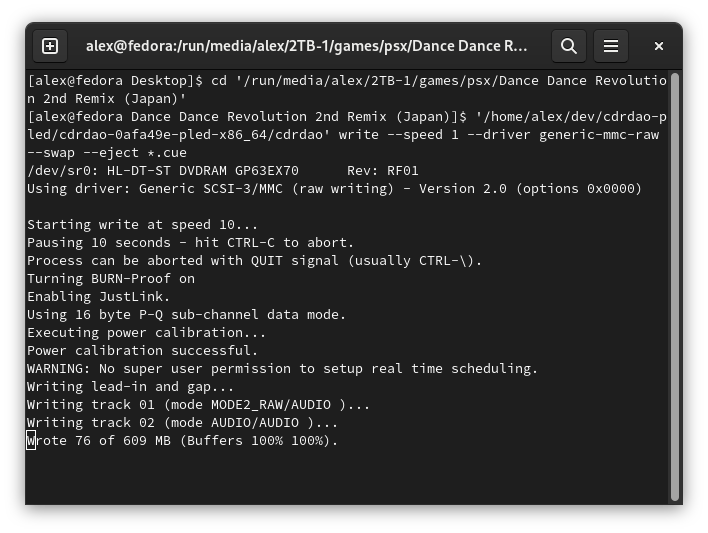
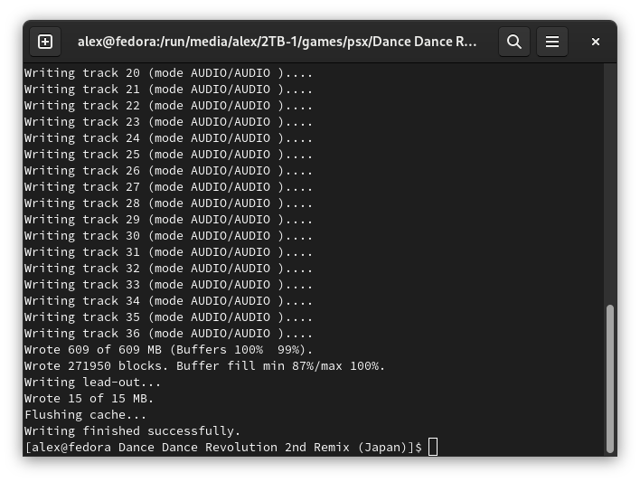
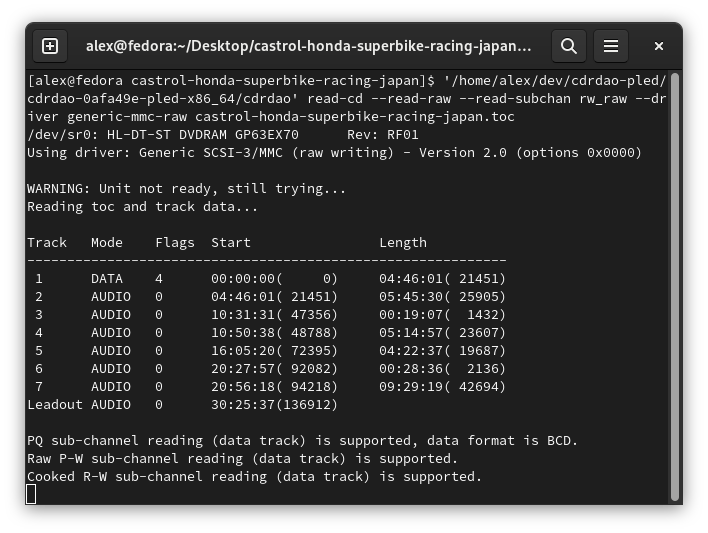
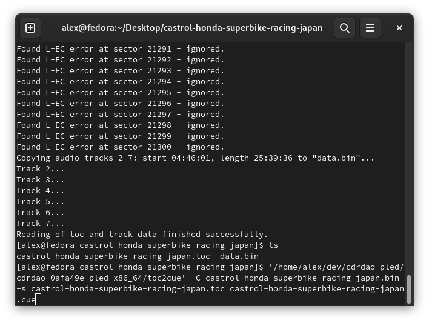
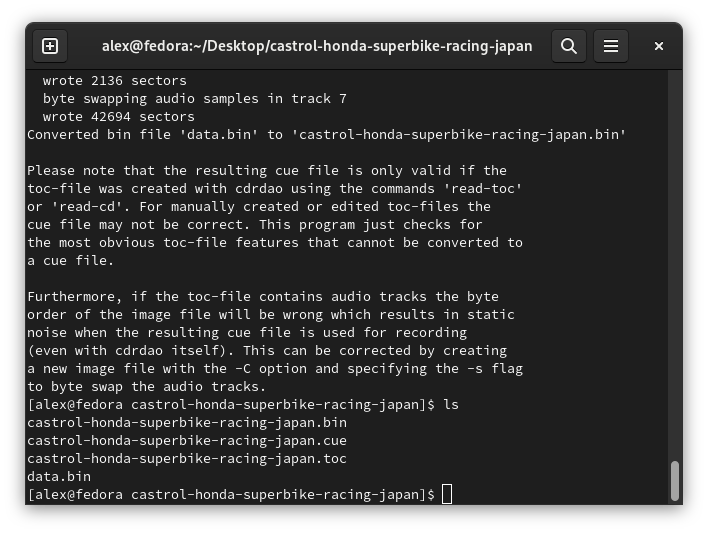

# [alex-free.github.io](https://alex-free.github.io)

[CDRDAO](https://cdrdao.sourceforge.net/) is a portable open source CD ripping and burning program. CDRDAO-PLED is a [portable](https://alex-free.github.io/pled) Linux x86_64 pre-built download that works on all modern Linux distros. CDRDAO is built from the latest (as of 1/31/2022) '[dev](https://github.com/cdrdao/cdrdao/tree/dev)' branch of CDRDAO, which now [includes](https://github.com/cdrdao/cdrdao/blob/0afa49e7c295fcbca2cb1e65d6c590c39927c6e8/ChangeLog#L13) a [bug fix](https://github.com/cdrdao/cdrdao/pull/14) that allows properly burning PSX BIN+CUE images which contain **both CD audio and [EDC](https://alex-free.github.io/tonyhax-international/anti-piracy-bypass.html#games-with-edc-protection) based addtional anti-piracy protection**.  

## Table Of Contents

*   [Downloads](#downloads)
*   [Burning BIN/CUE CD Images](#burning-bincue-cd-images)
*   [Burning BIN/TOC CD Images](#burning-bintoc-cd-images)
*   [Ripping With CDRDAO](#ripping-with-cdrdao)
*   [Edge-Cases](#edge-cases)
*   [Compiling From Source](#compiling-from-source)

## Links

*	[Homepage](https://alex-free.github.io/cdrdao)
*	[Github](https://github.com/alex-free/cdrdao-pled)

## Downloads

### Version 0afa49e-pled (1/31/2023)

*	[cdrdao-0afa49e-pled-x86_64](https://github.com/alex-free/cdrdao-pled/releases/download/v1.0.1-pled/cdrdao-0afa49e-pled-x86_64.zip) _For modern x86_64 Linux distros_

## Burning BIN/CUE CD Images

To burn a CD image in BIN/CUE format (with a few [exceptions](#edge-cases)), use the command below:

`cdrdao write --speed 1 --driver generic-mmc-raw --swap --eject yourgame.cue`

The `--speed 1` argument sets the writing speed to the slowest your CD burner supports.

The `--driver generic-mmc-raw` arguments specifies CDRDAO to use the `generic-mmc-raw` driver, which burns the CD image exactly as it is. The default driver used without specifiying these arguments is the `generic-mmc` driver. which like the other drivers in CDRDAO will auto-regenerate EDC data as the CD image is burned. This can change the EDC data read from the burned disc later, which some PSX games use as an additional anti-piracy check which if failed will lock up [the game](https://alex-free.github.io/tonyhax-international/anti-piracy-bypass.html#games-with-edc-protection).

The `--swap` argument is neccesary if the BIN/CUE CD image contains CD audio. Without it, you will get loud static when the CD audio tracks are played as they are by default 'byteswapped' by CDRDAO if this argument is not specified.

The `--eject` argument will automatically eject the disc immeidtely after a successful burn.

## Burning BIN/TOC CD Images

To burn a CD image in the native CDRDAO BIN/TOC format, use the following command:

`cdrdao write --speed 1 --driver generic-mmc-raw --eject yourgame.cue`

## Ripping With CDRDAO

CDRDAO by default will rip a CD to it's own native BIN/TOC format, this can be done with the command below.

`cdrdao read-cd --read-raw --read-subchan rw_raw --driver generic-mmc-raw yourgame.toc`

**NOTE:** The above command must be run immeditely after inserting the CD that you are ripping into your drive, **before it is mounted** by the computer OS. Otherwise, you will run into 'device busy' errors as CDRDAO can not access the CD while your OS has it mounted.

As long as this is **not a PSX CD-ROM that contains [LibCrypt protection](#psx-games-which-contain-libcrypt-protection)**, you can next use the `toc2cue` program included in CDRDAO to then convert this image to a proper BIN/CUE format (with audio tracks in the correct byte order and SubChannel data removed) that can then be used by other burning programs using this command:

`toc2cue -C yourgame.bin -s yourgame.toc yourgame.cue`

This will output 2 new files, `yourgame.bin` and `yourgame.cue`. These 2 files can be burned like any other BIN/CUE CD image, either by CDRDAO or another program. The other file pair: `yourgame.toc` and `data.bin` is the BIN/TOC fileset that can only be burned by CDRDAO.

## Edge-Cases

### PSX Games Which Contain LibCrypt Protection

CD images of PSX games which contain LibCrypt protection that have been ripped to the CloneCD format [(BIN/.CCD/.SUB)](https://github.com/Kippykip/SBITools) are not natively supported by CDRDAO.

You can however [rip](#ripping-with-cdrdao) CD images of PSX games which contain LibCrypt protection to the native CDRDAO RAW96DAO BIN/TOC format. The resulting CD image can then be properly burned with the protection intact.

### TOCPerfects/APRIP Patched CD Images

CD images of games that have been [TOCPerfect Patched](https://alex-free.github.io/ps1demoswap) and or [APrip Patched](https://alex-free.github.io/aprip/#patching-the-cd-image) can't be burned correctly with the `generic-mmc-raw` driver currently, because these patching programs currently don't regenerate EDC data themselves and actually rely on the EDC data being updated by the burning program. This is a current limitation of those programs however, and not a CDRDAO limitation in itself.

To burn CD images that have been TOCPerfect and or APRIP Patched, use the following command instead:

`cdrdao write --speed 1 --swap --eject yourgame.cue`

This command does not include the `--driver generic-mmc-raw` arguments, which makes CDRDAO fallback to the default `generic-mmc` driver which does regenerate EDC data.

## Compiling From Source

Building from source allows you to compile your own CDRDAO-PLED release for a different Linux version, distribution, and or CPU architecture (i.e. ARM, x86 32-bit, etc.).

First of all, install all the pre-requisites required:

*   [GNUmake](https://www.gnu.org/software/make/)
*   [GCC/G++](https://www.gnu.org/software/gcc)
*   [Bash](https://www.gnu.org/software/bash)
*   [Git](https://git-scm.com/)
*   [Libao](https://xiph.org/ao/)
*   [GNU Automake](https://www.gnu.org/software/automake/)
*   [GNU Autoconf](https://www.gnu.org/software/autoconf/)
*   [Zip](https://infozip.sourceforge.net/)

On Fedora Linux, you can install all of the above with this command:

`sudo dnf install autoconf automake libao-devel make bash git gcc g++ zip`

Clone the `cdrdao-pled` source tree from GitHub recursively using git:

    git clone --recursive https://github.com/alex-free/cdrdao-pled

Now that the entire CDRDAO-PLED source tree is recursively cloned, `cd` into the `cdrdao-pled` directory and execute the `./build.sh` script. Then just wait a bit for your release `.zip` file to be generated by the `build` script. A release directory will also be created, allowing you to immediately use CDRDAO-AF.

If you want to clean your CDRDAO-PLED source tree of all built binaries/releases, simply execute `./build.sh clean`. The `clean` argument will tell the `build` script to simply exit after resetting the source tree.
