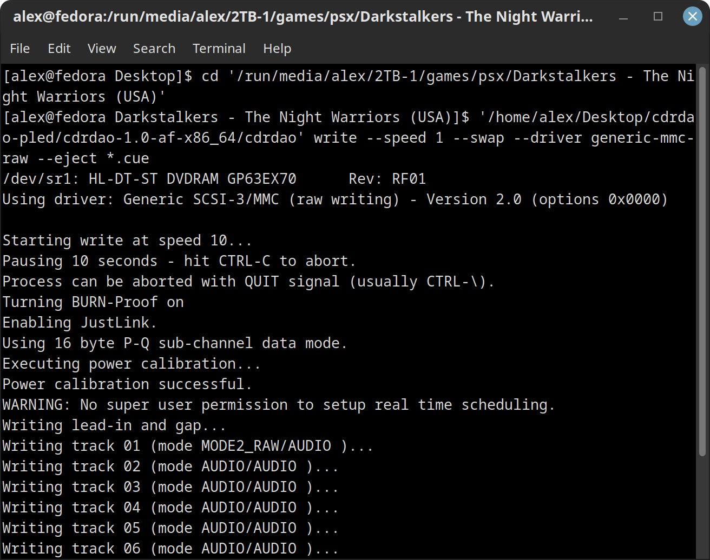

# [alex-free.github.io](https://alex-free.github.io)

# CDRDAO-AF - CDRDAO Fork With A Bug Fix For Using The Generic-MMC-Raw Driver With The `--swap` Argument

By Alex Free

[CDRDAO](https://cdrdao.sourceforge.net/) is a portable open source CD ripping and burning program. My fork of CDRDAO described on this page fixes a fatal [bug](https://github.com/cdrdao/cdrdao/issues/12) which prevented _some PSX disc images which contain an additional [(EDC-based)](https://alex-free.github.io/tonyhax-international/#bypassing-additional-edc-checks-found-in-some-games) anti-piracy measure from being burned correctly by CDRDAO_.

## Burning With The Generic-MMC Driver

For almost all PSX CD images (which do not contain an additional EDC-based anti-piracy measure), you have always been able to use one of the following commands below to burn a correct PSX CD-R disc with the [official CDRDAO](https://github.com/cdrdao/cdrdao/tree/dev):

`cdrdao write --speed 1 --driver generic-mmc --eject yourgamerip.cue`

_If using the above command results in a CD-R which has audio tracks containing loud static noise **instead of the exepected, correct CD audio playback** you need to `byteswap` the CD audio tracks while burning (by providing the `--swap` argument), with this alternative command below:_

`cdrdao write --speed 1 --driver generic-mmc --swap --eject yourgamerip.cue`

The `--swap` argument is _only required for some CD images that you want to burn, but not all_.

**You must first `cd` into the directory of the CD image rip before you run cdrdao, so that the `.cue` file of the rip is in the current directory**

The `generic-mmc` driver (like almost every other CD burning program by default as well) corrects any `incorrect EDC` data it finds inside the CD image used while burning. This is actually a feature, and usually what you want. **Unless you run into i.e. a PSX game which abuses this fact to provide an additional anti-piracy copy protection measure.**

Introducing EDC-based additional anti-piracy copy protection found in some later PSX games. If you burn a CD image of a game which contains this EDC-based additional anti-piracy copy protection with the `generic-mmc` driver, CDRDAO (just like most other CD burning programs by default) will actually 'correct' incorrect EDC data it finds (which has been intentionally placed in various sector(s) of the original CD-ROM from which the CD image was originally ripped from). This changes what data the game itself reads from a specific part of the disc during a specific time/check function. If the game's code itself doesn't read the expected 'incorrect' EDC data, it knows that this disc is a copy and will lock up.

The good news is, there is a way around this. Some CD burning programs provide an option to not 'update/correct' EDC data as the CD image is burned to a CD-R. CDRDAO provides the `generic-mmc-raw` driver, which does offer this functionality. The problem is, since seemingly the inception of the `generic-mmc-raw` driver, _the `--swap` argument does not work in combination with the generic-mmc-raw driver specifically_ due to a bug. This prevents you from burning a CD-R which both doesn't update any EDC data, and has the correct byteorder for the CD audio tracks. CD images that do not require the `--swap` argument work as expected when burned by the `generic-mmc-raw` driver, but it is currently impossible to correctly burn CD images that do require the `--swap` argument with the `generic-mmc-raw` driver in the official CDRDAO.

I have finally tracked down this previously unknown [bug](https://github.com/cdrdao/cdrdao/issues/12), and provided a [fix](https://github.com/cdrdao/cdrdao/pull/14) that I am trying to get into the official CDRDAO. For now, I have created my [own fork](https://github.com/alex-free/cdrdao/tree/dev) which provides the bug fix enabling the `--swap` argument with the `generic-mmc-raw` driver correctly.

## Burning With The Generic-MMC-Raw Driver

So for [almost any PSX game CD image](#psx-cd-images-which-wont-work-the-generic-mmc-raw-driver) (**including those which contain additional EDC-based copy protection**), you can use one of the below CDRDAO commands to correctly burn them:

`cdrdao write --speed 1 --driver generic-mmc-raw --eject yourgamerip.cue`

_If using the above command results in a CD-R which has audio tracks containing loud static noise **instead of the exepected, correct CD audio playback** you need to `byteswap` the CD audio tracks while burning (by providing the `--swap` argument), with this alternative command below:_

`cdrdao write --speed 1 --driver generic-mmc-raw --swap --eject yourgamerip.cue`

The `--swap` argument is _only required for some CD images that you want to burn, but not all_.

**You must first `cd` into the directory of the CD image rip before you run cdrdao, so that the `.cue` file of the rip is in the current directory**:

### PSX CD Images Which Won't Work The Generic-MMC-Raw Driver

*   CD images of LibCrypt games currently can't be burned correctly with the `generic-mmc-raw` driver.

*   CD images of games that have been [TOCPerfect Patched](https://alex-free.github.io/ps1demoswap) and or [APrip Patched](https://alex-free.github.io/aprip/#patching-the-cd-image) can't be burned correctly with the `generic-mmc-raw` driver currently, because these patching programs actually rely on the EDC data being updated by the `generic-mmc` driver during the burn. These patcher programs do not update the EDC themselves after patching/changing/updating the CD image. This is a current limitation of those programs however, and not a CDRDAO limitation in itself.

## Links

*	[Homepage](https://alex-free.github.io/cdrdao)
*	[Github](https://github.com/alex-free/cdrdao/tree/dev)

## Downloads

### Version 1.0-af (12/21/2022)

*	[cdrdao-1.0-af-x86_64](https://github.com/alex-free/cdrdao-pled/releases/download/v1.0-af/cdrdao-1.0-af-x86_64.zip) _For modern x86_64 Linux distros_

## Compiling From Source

Installing from source allows you to compile your own CDRDAO-AF release for a different Linux version, distribution, and or CPU architecture (i.e. ARM, x86 32-bit, etc.).

First of all, install all the pre-requisites required for building CDRDAO-AF from source:

*   [GNUmake](https://www.gnu.org/software/make/)
*   [GCC/G++](https://www.gnu.org/software/gcc)
*   [Bash](https://www.gnu.org/software/bash)
*   [Git](https://git-scm.com/)
*   [Libao](https://xiph.org/ao/)
*   [GNU Automake](https://www.gnu.org/software/automake/)
*   [GNU Autoconf](https://www.gnu.org/software/autoconf/)
*   [Zip](https://infozip.sourceforge.net/)

On Fedora Linux, you can install all of the above with this command:

`sudo dnf install autoconf automake libao-devel make bash git gcc g++ zip`

The next 2 sections describe the 2 different ways to compile my cdrdao fork. The `Pled Method` creates a portable cdrdao release that can be used on multiple linux distros that share the same CPU architecture. The `Traditional Method` describes the original, intended method of installing/compiling cdrdao manually, as well as installing directly into `/usr/local` so that cdrdao is available in your `$PATH` (although it is not portable in this case).

### Pled Method

Clone the `cdrdao-pled` source tree from GitHub recursively using git:

    git clone --recursive https://github.com/alex-free/cdrdao-pled

Now that the entire CDRDAO-AF source tree is recursively cloned, `cd` into the `cdrdao-pled` directory and execute the `./build.sh` script. Then just wait a bit for your release `.zip` file to be generated by the `build` script. A release directory will also be created, allowing you to immediately use CDRDAO-AF.

If you want to clean your CDRDAO-AF source tree of all built binaries/releases, simply execute `./build.sh clean`. The `clean` argument will tell the `build` script to simply exit after resetting the source tree.

### Traditional Method

Clone my CDRDAO fork's `dev` branch from GitHub using git:

    git clone -b dev https://github.com/alex-free/cdrdao

Next, `cd` into the `cdrdao` directory and execute the following commands:

`./autogen.sh`

`autoreconf`

`./configure`

`make`

You can then `make install` into `/usr/local`.